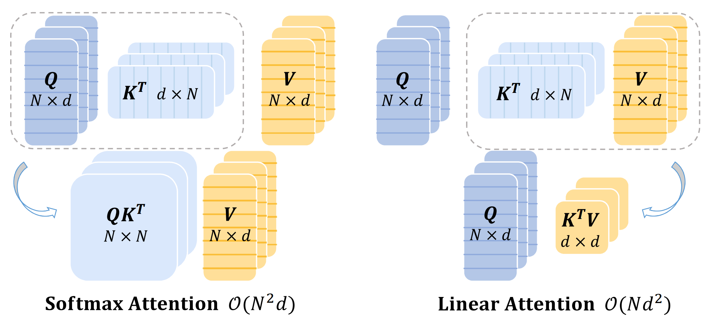

# FLatten Transformer

This repo contains the official **PyTorch** code and pre-trained models for FLatten Transformer (ICCV 2023).

+ [FLatten Transformer: Vision Transformer with Focused Linear Attention](https://arxiv.org/abs/2308.00442)

## Introduction

### Motivation



The quadratic computation complexity of self-attention $\mathcal{O}(N^2)$ has been a long-standing problem when applying Transformer models to vision tasks. Apart from reducing attention regions, linear attention is also considered as an effective solution to avoid excessive computation costs. By approximating Softmax with carefully designed mapping functions, linear attention can switch the computation order in the self-attention operation and achieve linear complexity $\mathcal{O}(N)$. Nevertheless, current linear attention approaches either suffer from severe performance drop or involve additional computation overhead from the mapping function. In this paper, we propose a novel **Focused Linear Attention** module to achieve both high efficiency and expressiveness.


### Method


 In this paper, we first perform a detailed analysis of the inferior performances of linear attention from two perspectives: focus ability and feature diversity. Then, we introduce a simple yet effective mapping function and an efficient rank restoration module and propose our **Focused Linear Attention (FLatten)** which adequately addresses these concerns and achieves high efficiency and expressive capability.

### Results

- Comparison of different models on ImageNet-1K.


- Accuracy-Runtime curve on ImageNet.


## Dependencies

- Python 3.9
- PyTorch == 1.11.0
- torchvision == 0.12.0
- numpy
- timm == 0.4.12
- einops
- yacs

## Pretrained Models

Based on different model architectures, we each provide a pretrained model, as listed below.

| model  | acc@1 | config | pretrained weights |
| :---: | :---: | :---: | :---: |
| FLatten-PVT-T | 77.8 (+2.7) | [config](cfgs/flatten_pvt_t.yaml) | [TsinghuaCloud (In process)](https://cloud.tsinghua.edu.cn/) |
| FLatten-PVTv2-B0 | 71.1 (+0.6) | [config](cfgs/flatten_pvt_v2_b0.yaml) | [TsinghuaCloud (In process)](https://cloud.tsinghua.edu.cn/) |
| FLatten-Swin-T | 82.1 (+0.8) | [config](cfgs/flatten_swin_t.yaml) | [TsinghuaCloud (In process)](https://cloud.tsinghua.edu.cn/) |
| FLatten-CSwin-T | 83.1 (+0.4) | [config](cfgs/flatten_cswin_t.yaml) | [TsinghuaCloud (In process)](https://cloud.tsinghua.edu.cn/) |

Evaluate one model on ImageNet:

```shell
python -m torch.distributed.launch --nproc_per_node=8 main.py --cfg <path-to-config-file> --data-path <imagenet-path> --output <output-path> --eval --resume <path-to-pretrained-weights>
```

Outputs of the four pretrained models are:

```
[2023-07-21 07:50:09 flatten_pvt_tiny] (main.py 294): INFO  * Acc@1 77.758 Acc@5 93.910
[2023-07-21 07:50:09 flatten_pvt_tiny] (main.py 149): INFO Accuracy of the network on the 50000 test images: 77.8%

[2023-07-21 07:51:36 flatten_pvt_v2_b0] (main.py 294): INFO  * Acc@1 71.098 Acc@5 90.596
[2023-07-21 07:51:36 flatten_pvt_v2_b0] (main.py 149): INFO Accuracy of the network on the 50000 test images: 71.1%

[2023-07-21 07:46:13 flatten_swin_tiny_patch4_224] (main.py 294): INFO  * Acc@1 82.106 Acc@5 95.900
[2023-07-21 07:46:13 flatten_swin_tiny_patch4_224] (main.py 149): INFO Accuracy of the network on the 50000 test images: 82.1%

[2023-07-21 07:52:46 FLatten_CSWin_tiny](main.py 294): INFO  * Acc@1 83.130 Acc@5 96.376
[2023-07-21 07:52:46 FLatten_CSWin_tiny](main.py 149): INFO Accuracy of the network on the 50000 test images: 83.1%
```

## Train Models from Scratch

- **To train `FLatten-PVT-T/S/M/B` on ImageNet from scratch, run:**

```shell
python -m torch.distributed.launch --nproc_per_node=8 main.py --cfg ./cfgs/flatten_pvt_t.yaml --data-path <imagenet-path> --output <output-path> --find-unused-params
```

```shell
python -m torch.distributed.launch --nproc_per_node=8 main.py --cfg ./cfgs/flatten_pvt_s.yaml --data-path <imagenet-path> --output <output-path> --find-unused-params
```

```shell
python -m torch.distributed.launch --nproc_per_node=8 main.py --cfg ./cfgs/flatten_pvt_m.yaml --data-path <imagenet-path> --output <output-path> --find-unused-params
```

```shell
python -m torch.distributed.launch --nproc_per_node=8 main.py --cfg ./cfgs/flatten_pvt_b.yaml --data-path <imagenet-path> --output <output-path> --find-unused-params
```

- **To train `FLatten-PVT-v2-b0/1/2/3/4` on ImageNet from scratch, run:**

```shell
python -m torch.distributed.launch --nproc_per_node=8 main.py --cfg ./cfgs/flatten_pvt_v2_b0.yaml --data-path <imagenet-path> --output <output-path>
```

```shell
python -m torch.distributed.launch --nproc_per_node=8 main.py --cfg ./cfgs/flatten_pvt_v2_b1.yaml --data-path <imagenet-path> --output <output-path>
```

```shell
python -m torch.distributed.launch --nproc_per_node=8 main.py --cfg ./cfgs/flatten_pvt_v2_b2.yaml --data-path <imagenet-path> --output <output-path>
```

```shell
python -m torch.distributed.launch --nproc_per_node=8 main.py --cfg ./cfgs/flatten_pvt_v2_b3.yaml --data-path <imagenet-path> --output <output-path>
```

```shell
python -m torch.distributed.launch --nproc_per_node=8 main.py --cfg ./cfgs/flatten_pvt_v2_b4.yaml --data-path <imagenet-path> --output <output-path>
```

- **To train `FLatten-Swin-T/S/B` on ImageNet from scratch, run:**

```shell
python -m torch.distributed.launch --nproc_per_node=8 main.py --cfg ./cfgs/flatten_swin_t.yaml --data-path <imagenet-path> --output <output-path>
```

```shell
python -m torch.distributed.launch --nproc_per_node=8 main.py --cfg ./cfgs/flatten_swin_s.yaml --data-path <imagenet-path> --output <output-path>
```

```shell
python -m torch.distributed.launch --nproc_per_node=8 main.py --cfg ./cfgs/flatten_swin_b.yaml --data-path <imagenet-path> --output <output-path>
```

- **To train `FLatten-CSwin-T/S/B` on ImageNet from scratch, run:**

```shell
python -m torch.distributed.launch --nproc_per_node=8 main_ema.py --cfg ./cfgs/flatten_cswin_t.yaml --data-path <imagenet-path> --output <output-path> --model-ema --model-ema-decay 0.99984
```

```shell
python -m torch.distributed.launch --nproc_per_node=8 main_ema.py --cfg ./cfgs/flatten_cswin_s.yaml --data-path <imagenet-path> --output <output-path> --model-ema --model-ema-decay 0.99984
```

```shell
python -m torch.distributed.launch --nproc_per_node=8 main_ema.py --cfg ./cfgs/flatten_cswin_b.yaml --data-path <imagenet-path> --output <output-path> --model-ema --model-ema-decay 0.99982
```

## Fine-tuning on higher resolution

Fine-tune a `FLatten-Swin-B` model pre-trained on 224x224 resolution to 384x384 resolution:

```shell
python -m torch.distributed.launch --nproc_per_node=8 main.py --cfg ./cfgs/flatten_swin_b_384.yaml --data-path <imagenet-path> --output <output-path> --pretrained <path-to-224x224-pretrained-weights>
```

Fine-tune a `FLatten-CSwin-B` model pre-trained on 224x224 resolution to 384x384 resolution:

```shell
python -m torch.distributed.launch --nproc_per_node=8 main_ema.py --cfg ./cfgs/flatten_cswin_b_384.yaml --data-path <imagenet-path> --output <output-path> --pretrained <path-to-224x224-pretrained-weights> --model-ema --model-ema-decay 0.99982
```

## Acknowledgements

This code is developed on the top of [Swin Transformer](https://github.com/microsoft/Swin-Transformer). The computational resources supporting this work are provided by [Hangzhou High-Flyer AI Fundamental Research Co.,Ltd](https://www.high-flyer.cn/)

## Contact

If you have any questions, please feel free to contact the authors. 

Dongchen Han: [hdc19@mails.tsinghua.edu.cn](mailto:hdc19@mails.tsinghua.edu.cn)

Xuran Pan:  [pxr18@mails.tsinghua.edu.cn](mailto:pxr18@mails.tsinghua.edu.cn)
